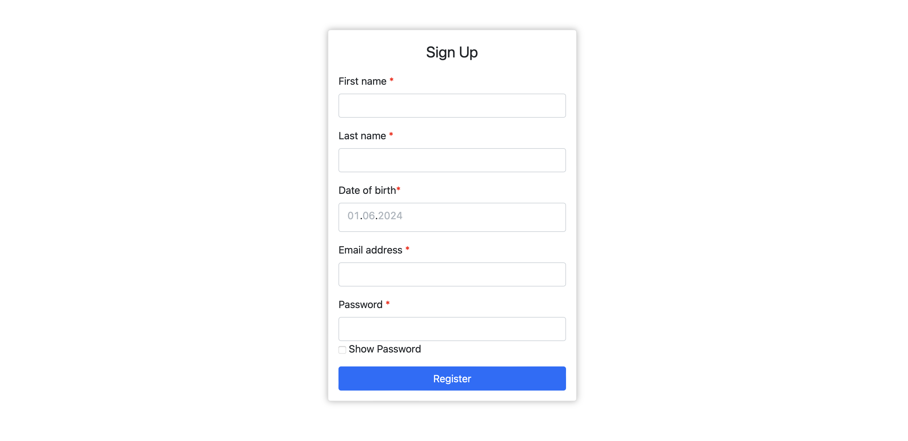
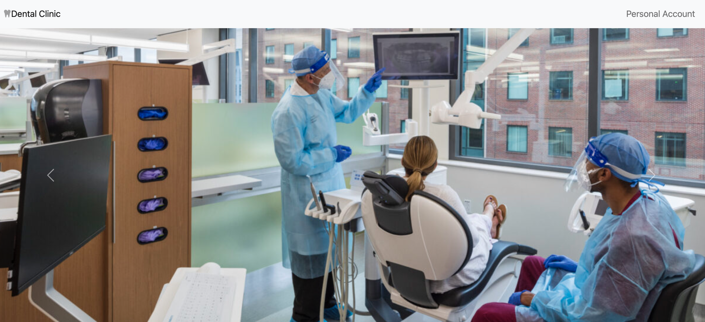
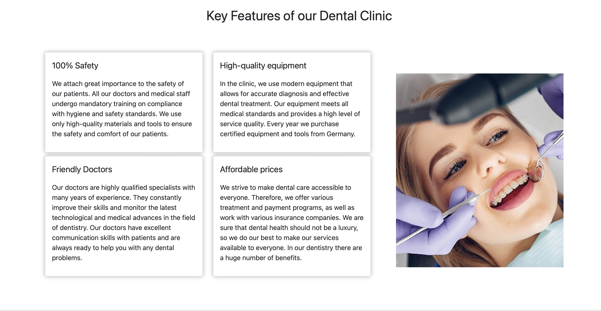
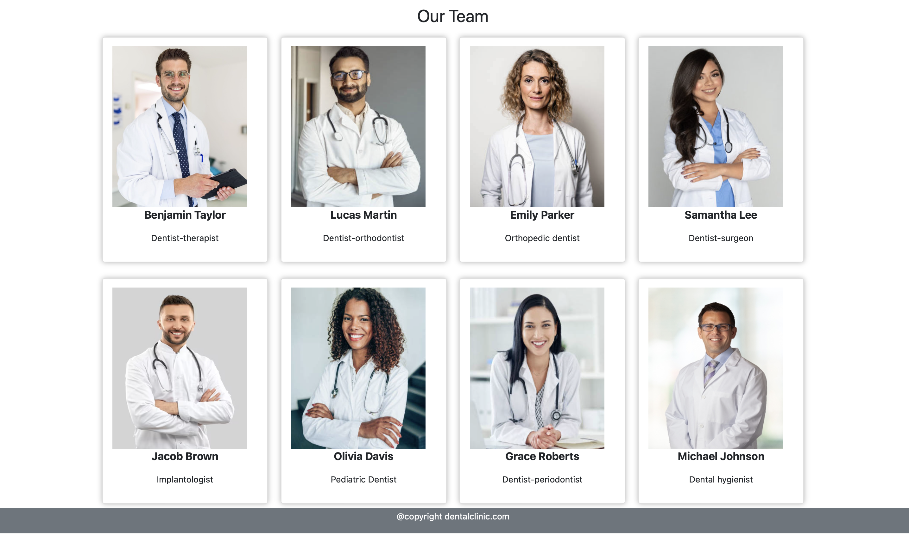
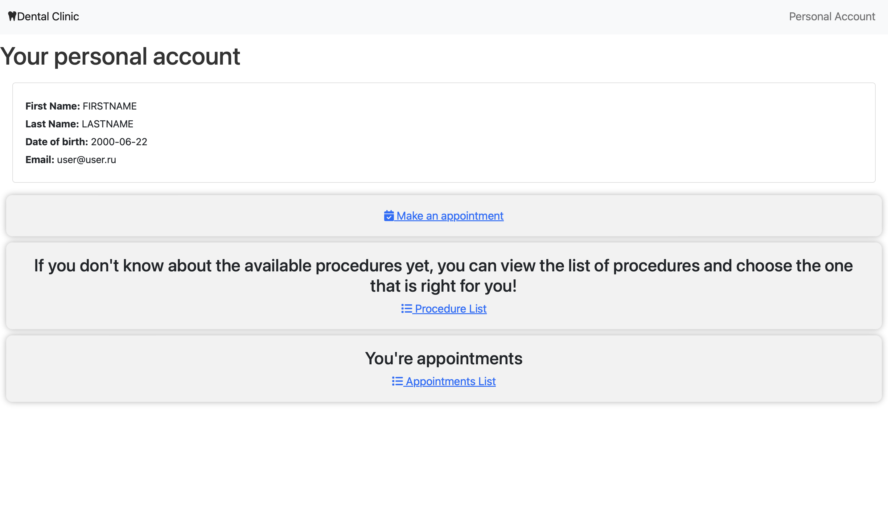
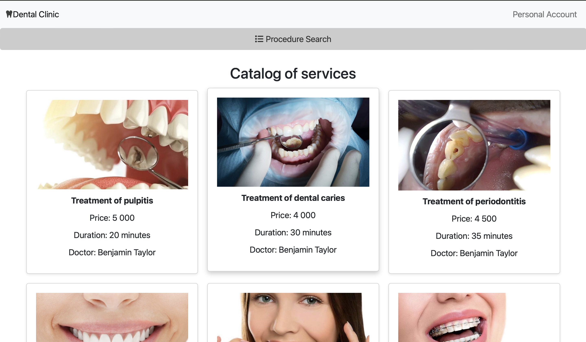
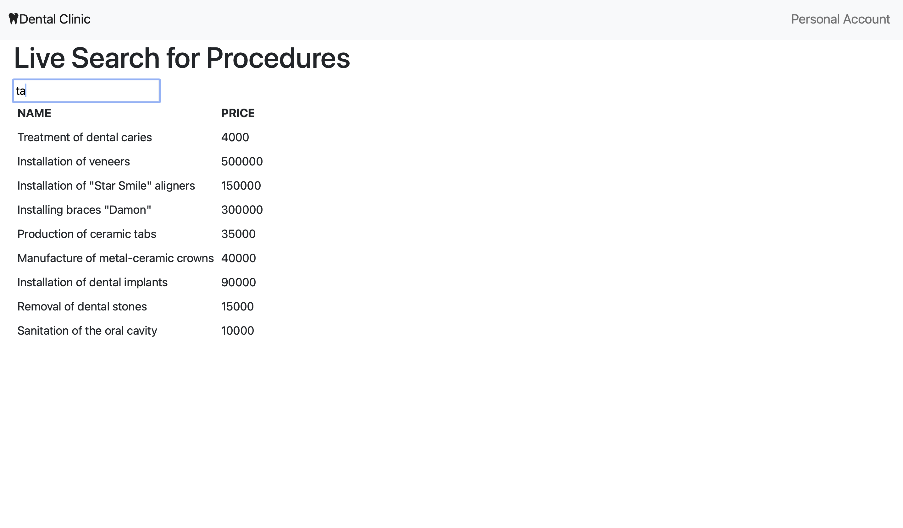
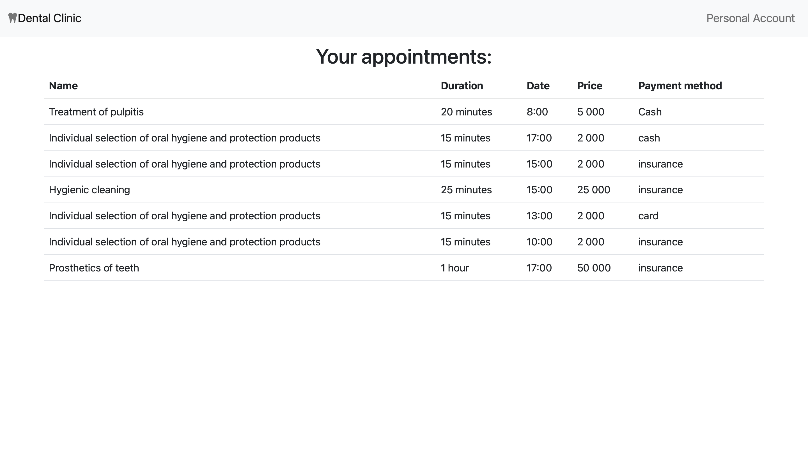
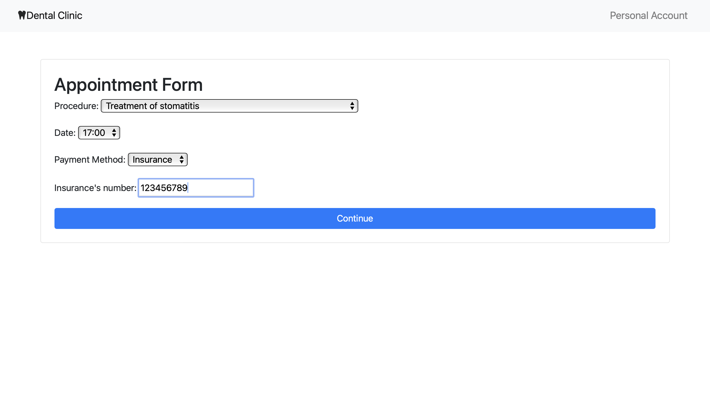

# Стоматологическая клиника

## Описание
Данный Spring Boot проект предназначен для управления стоматологической клиникой. Он позволяет управлять записями на прием к специалисту и свободным врменем, лечением пациентов.
Попасть в главное меню и личный кабинет могут лишь авторизованные пользователи. Если у пользователя еще нет аккаунта, он может создать его.

На главной странице пользователь может ознакомится с клиникой, врачами и процедурами.

В личном кабинете клиент может просмотреть свои записи на прием, найти нужную процедуру с помощью Live Search, а также записаться на прием, создав запись.

Для этого он должен перейти на страницу /createAppointment и заполнить форму: выбрать наименование процедуры из выпадающего списка, выбрать свободное время и метод оплаты.
В случае выбора клиентом страховки в качестве способа оплаты, ему необходимо ввести номер страховки.
insurance-api отвечает за одобрение страховки (в случае если номер страховки не превышет 20 символов) или ее отклонение.

В своем личном кабинете Админ может управлять пациентами: создавать нового, удалять или обновлять его по ID, а также просмотреть всех пациентом и информацию о них.
Кроме того, Админ может создавать, просматривать и удалять все записи на прием.

Основное приложение (dental-clinic) и insurance-api работают на разных портах.

## Технологии
- Spring Boot
- Spring Data JPA
- Spring Security
- Freemarker
- PostgreSQL
- Lombok
